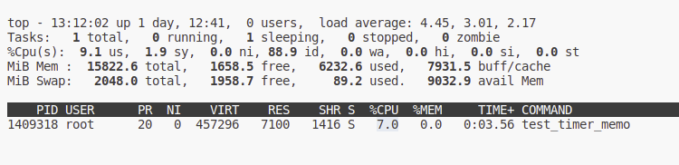
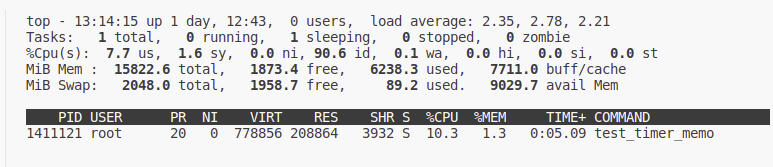

## test_memory_pool

> 多线程，阅后即焚式的内存分配

### define FIRST

#### 默认编译

``` bash
--------------------------------------------------------------------------------
Benchmark                                      Time             CPU   Iterations
--------------------------------------------------------------------------------
benchmark_map_memory_pool_work_thread   15156368 ns       754119 ns          907
benchmark_pmr_memory_pool_work_thread    6078805 ns       700091 ns         1101
benchmark_malloc_work_thread              702860 ns       542581 ns         1129
benchmark_vector_work_thread             1287080 ns       835164 ns          859
```


#### Release
``` bash
--------------------------------------------------------------------------------
Benchmark                                      Time             CPU   Iterations
--------------------------------------------------------------------------------
benchmark_map_memory_pool_work_thread    5070168 ns       797660 ns          889
benchmark_pmr_memory_pool_work_thread    5302087 ns       850607 ns          830
benchmark_malloc_work_thread              770752 ns       635075 ns         1040
benchmark_vector_work_thread              810265 ns       640395 ns         1006
```


- benchmark_map_memory_pool_work_thread 的执行时间相对较低，表明使用内存池的内存分配和管理方法在多线程工作负载下表现良好。
- benchmark_pmr_memory_pool_work_thread 的执行时间相对较高，表明使用 C++17 的 std::pmr::synchronized_pool_resource 进行内存分配和管理的方法在多线程工作负载下可能开销较大。这个结果可能是由于 std::pmr::synchronized_pool_resource 内部实现较复杂或与多线程的互斥操作有关。
- benchmark_malloc_work_thread 的执行时间比使用内存池的方法更短，表明标准的 malloc 函数在多线程工作负载下的性能仍然很好。这可能是因为 malloc 使用了更低级别的系统调用来进行内存分配，通常不涉及大规模的互斥操作。
- benchmark_vector_work_thread 的执行时间相对较低，这表明标准库的 std::vector 在多线程工作负载下的性能也不错。

### define SECOND

#### 默认编译
```bash
--------------------------------------------------------------------------------
Benchmark                                      Time             CPU   Iterations
--------------------------------------------------------------------------------
benchmark_map_memory_pool_work_thread   36441833 ns       723525 ns          100
benchmark_pmr_memory_pool_work_thread   33958285 ns       810413 ns          100
benchmark_malloc_work_thread            31392803 ns       828437 ns          100
benchmark_vector_work_thread            36029864 ns       947579 ns          100
```

#### Release
```bash
--------------------------------------------------------------------------------
Benchmark                                      Time             CPU   Iterations
--------------------------------------------------------------------------------
benchmark_map_memory_pool_work_thread    6371143 ns       692212 ns         1071
benchmark_pmr_memory_pool_work_thread    5454846 ns       643017 ns         1130
benchmark_malloc_work_thread             1797592 ns       557769 ns         1186
benchmark_vector_work_thread             2070894 ns       548701 ns         1260
```
> benchmark_pmr_memory_pool_work_thread 无法运行完成（OOM killed）

#### 总结
realse better when use mallic and vector

### How to test cache missing ? 
```bash
perf stat -e cache-references,cache-misses ./test_memory_pool
```

### additional information
> 阅后即焚式的内存分配，单线程，相同大小的分配模式下，map_memory_pool总能得到相同的内存地址，pmr_memory_pool的地址是随机的，vector/malloc在一定时间内拿到的地址是唯一的


## test multi thread malloc and memory pool
> just fouce on cpu

### map_memory_pool



### pmr_memory_pool


### malloc
